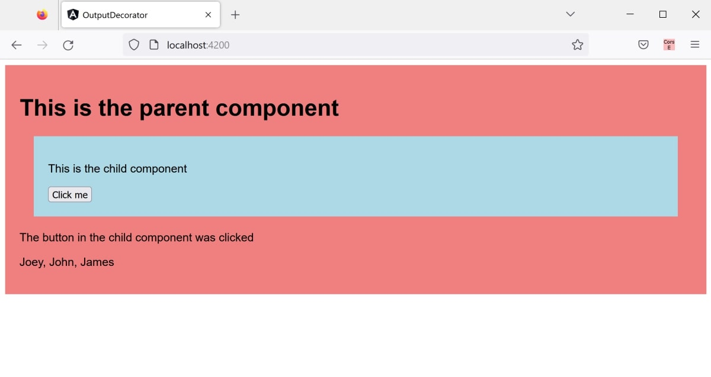

# angular-output-decorator-example
This is an example of how to use the output decorator in Angular

## To Run

* Run `npm install` in the root directory to add the necessary npm packages to the project.
* Once completed, run `ng serve`.
* Navigate to `localhost:4200` in a browser.

## To Build

* Run `ng build` to build the project. The build artifacts will be stored in the dist/ directory. 
* Use `ng build --prod` for a production build.

